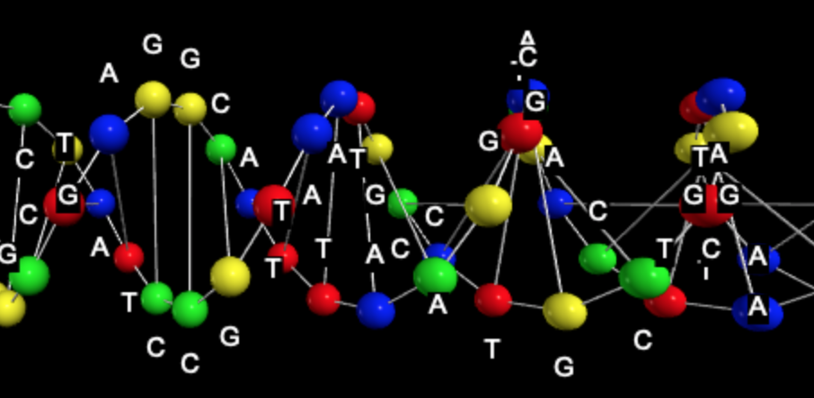

# HUIJH

2019년 1학기 정보 프로젝트입니다. 이 프로젝트의 목표는 핵산(RNA, DNA, mRNA)를 분석하는 것을 돕고, 핵산의 3D 모형을 만들어 핵산에 대한 이해를 높이는 것 입니다.
[유튜브 영상](https://youtu.be/y0rBk68zLeM)

## 제작
연구소장 **연제후**
연구원 **한석휘**

## 구현된 기능
1. 핵산(RNA, mRNA, DNA) 전사
2. 번역
3. 상보성 핵산 
4. 핵산 연장
5. vpython을 이용한 핵산 3D 모델링
